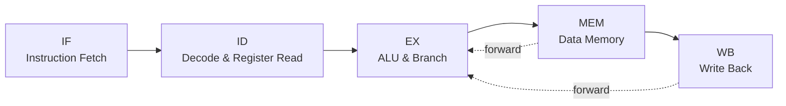

# 32-bit Pipelined RISC-V CPU

[](https://en.wikipedia.org/wiki/Verilog)
[](https://riscv.org/)
[](https://www.amd.com/en/products/software/adaptive-socs-and-fpgas/vivado.html)
[](#project-status)

An educational, synthesizable implementation of a **32-bit pipelined RISC-V processor** written in Verilog. The design separates instruction processing into the classic five pipeline stages—Instruction Fetch, Instruction Decode, Execute, Memory Access, and Write Back—and includes data forwarding for common register dependencies.

The project is organized as a Xilinx Vivado design and includes a self-contained instruction image, stage-level testbenches, and an end-to-end CPU testbench.

> **Note:** This repository is intended for learning, RTL experimentation, and simulation. It should not be treated as a production-ready or fully verified implementation of the complete RV32I specification.

## Architecture



### Pipeline Stages

| Stage | Main responsibilities | RTL module |
|---|---|---|
| IF | Program-counter update, instruction fetch, and `PC + 4` generation | `instruction_fetch.v` |
| ID | Instruction decode, register-file access, immediate generation, and ID/EX pipeline registers | `instruction_decode.v` |
| EX | Operand forwarding, ALU operation, branch-target calculation, and EX/MEM pipeline registers | `instruction_execute.v` |
| MEM | Data-memory access and MEM/WB pipeline registers | `instruction_memory.v` |
| WB | Selection of ALU, memory, or `PC + 4` result for register write-back | `instruction_writeback.v` |

The primary integration module is `RISC_V_CPU.v`.

## Key Features

- 32-bit RISC-V datapath based on the RV32I instruction formats
- Five-stage pipeline: IF, ID, EX, MEM, and WB
- 32 × 32-bit register file with register `x0` hardwired to zero
- Separate 256 × 32-bit instruction and data memories
- ALU operations for addition, subtraction, AND, OR, and signed set-less-than
- Immediate generation for I-, S-, and B-type formats
- Control paths for register-register ALU, immediate ALU, load, store, branch, and jump instruction classes
- EX-stage branch decision and target-address calculation
- Data forwarding from the MEM and WB stages to both EX-stage ALU operands
- Active-low asynchronous reset for pipeline and state registers
- Modular and full-CPU Verilog testbenches

## Instruction Scope

The current modular datapath contains decoding and control logic for the following instruction groups:

| Group | Examples represented in the RTL | Purpose |
|---|---|---|
| Register-register | `ADD`, `SUB`, `AND`, `OR`, `SLT` | Arithmetic and logical operations |
| Immediate | `ADDI` and ALU-immediate formats | Register-immediate operations |
| Load | `LW` control path | Read a 32-bit word from data memory |
| Store | `SW` control path | Write a 32-bit word to data memory |
| Branch | `BEQ` control path | Conditional PC-relative branch |
| Jump | `JAL` control path | PC-relative jump and link |

Instruction support is still under development. Before relying on an instruction in a larger system, verify its decode, immediate generation, hazard behavior, and write-back path with a dedicated test.

## Hazard Handling

`hazard_unit.v` resolves common read-after-write dependencies by forwarding:

- The current MEM-stage ALU result to either EX-stage source operand
- The WB-stage result to either EX-stage source operand

MEM-stage forwarding has priority over WB-stage forwarding.

The present hazard unit does not implement a general pipeline stall mechanism, load-use interlock, or control-hazard flush logic. Programs and future extensions should account for these limitations.

## Repository Structure

```text
RISC_V_CPU/
├── RISC-V_CPU.xpr
├── RISC-V_CPU.srcs/
│   ├── sources_1/new/
│   │   ├── RISC_V_CPU.v              # Primary top-level CPU
│   │   ├── instruction_fetch.v       # IF stage
│   │   ├── instruction_decode.v      # ID stage
│   │   ├── instruction_execute.v     # EX stage
│   │   ├── instruction_memory.v      # MEM stage
│   │   ├── instruction_writeback.v   # WB stage
│   │   ├── control_unit_top.v        # Decoder integration
│   │   ├── main_decoder.v            # Main control decoder
│   │   ├── ALU_decoder.v             # ALU control decoder
│   │   ├── hazard_unit.v             # EX operand forwarding
│   │   ├── register_file.v
│   │   ├── data_memory.v
│   │   ├── instruction_memmory.v     # Instruction ROM used by IF
│   │   ├── extend.v                  # Immediate generator
│   │   ├── ALU.v
│   │   ├── pc_module.v
│   │   ├── pc_adder.v
│   │   ├── mux_2_1.v
│   │   ├── mux_3_1.v
│   │   └── memfile.mem               # Simulation instruction image
│   └── sim_1/new/
│       ├── tb_RISC_V_CPU.v
│       ├── tb_instruction_fetch.v
│       ├── tb_instruction_decode.v
│       ├── tb_instruction_execute.v
│       ├── tb_instruction_memory.v
│       └── tb_instruction_writeback.v
└── simulation_tb_RISC_V_CPU_behav.wcfg
```

The repository also contains experimental or alternative RTL files. The module hierarchy instantiated by `RISC_V_CPU.v` is the reference implementation documented above.

## Requirements

- **Xilinx Vivado 2018.3**, as recorded in the project file
- A simulator capable of compiling Verilog-2001 RTL
- No RISC-V software toolchain is required for the included test image because instructions are loaded directly from `memfile.mem`

The Vivado project is configured for the Xilinx `xc7k70tfbv676-1` device.

The RTL may be retargeted to another FPGA by changing the project part and supplying the appropriate timing and pin constraints.

## Running the Full-CPU Simulation

### 1. Clone the repository

```bash
git clone https://github.com/nguyen-ky2910/RISC_V_CPU.git
cd RISC_V_CPU
```

### 2. Open the project

Start Xilinx Vivado 2018.3 and open:

```text
RISC-V_CPU.xpr
```

### 3. Select the simulation top

In **Simulation Sources**, set the following module as the simulation top:

```text
tb_RISC_V_CPU
```

### 4. Run the simulation

Select:

```text
Run Simulation → Run Behavioral Simulation
```

Run the simulation for at least `220 ns`, or select **Run All**.

### 5. Inspect the waveforms

Useful signals to inspect include:

- Program counter
- Fetched instruction
- Pipeline control signals
- ALU operands and result
- Branch target and branch decision
- Data-memory interface
- Forwarding selectors
- Register write-back address and data

The full-CPU testbench generates a 10 ns clock period, holds the active-low reset for 20 ns, and then runs the processor for 200 ns.

## Running Stage-Level Tests

The `sim_1/new` directory contains focused testbenches for the five major pipeline stages.

To run an individual testbench:

1. Locate the desired testbench under **Simulation Sources**.
2. Right-click the testbench.
3. Select **Set as Top**.
4. Launch **Behavioral Simulation**.
5. Compare the generated outputs with the stimulus and expected behavior defined in the testbench.

Available stage-level testbenches include:

| Testbench | Tested component |
|---|---|
| `tb_instruction_fetch.v` | Instruction Fetch stage |
| `tb_instruction_decode.v` | Instruction Decode stage |
| `tb_instruction_execute.v` | Execute stage |
| `tb_instruction_memory.v` | Memory stage |
| `tb_instruction_writeback.v` | Write Back stage |
| `tb_RISC_V_CPU.v` | Integrated five-stage processor |

## Loading a Different Program

Instruction memory is initialized using:

```verilog
$readmemh("memfile.mem", mem);
```

To test another program, replace the contents of:

```text
RISC-V_CPU.srcs/sources_1/new/memfile.mem
```

Each line should contain one 32-bit instruction represented as an eight-digit hexadecimal value:

```text
00500093
00700113
002081B3
```

Keep `memfile.mem` in the Vivado simulation sources so that the simulator can locate it at runtime.

## Project Status

This processor is an educational work in progress.

Potential future improvements include:

- Completing and verifying the intended RV32I instruction subset
- Adding load-use hazard detection and pipeline stalling
- Flushing younger instructions after taken branches and jumps
- Expanding self-checking instruction and integration tests
- Adding synthesis and timing reports
- Reporting FPGA resource utilization
- Adding board-specific timing and pin constraints
- Testing the design on physical FPGA hardware

## Contributing

Bug reports, verification improvements, and RTL enhancements are welcome.

For substantial changes, open an issue first and describe the intended behavior. Please keep changes modular and include a focused testbench or reproducible simulation procedure whenever possible.

## Author

Developed by [nguyen-ky2910](https://github.com/nguyen-ky2910) as an educational project in RISC-V architecture, pipelined processor design, and Verilog RTL development.

## License

No license file is currently included in this repository

Unless a license is added, copyright remains with the repository owner and reuse is not automatically granted. If the project is intended for open-source reuse, consider adding a standard license such as:

- MIT License
- BSD 2-Clause License
- Apache License 2.0
